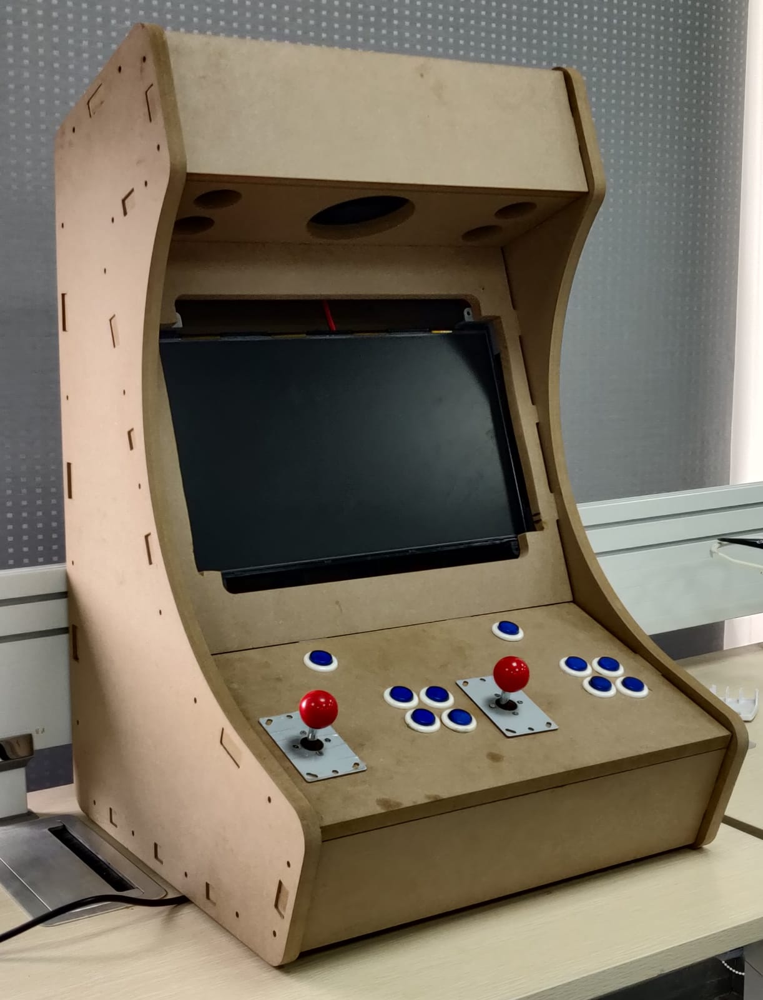

# Bartop Arcade Machine

## Project Overview

This project demonstrates how to build a bartop arcade machine using a Raspberry Pi 4 and arcade controllers. Our goal is to create an entertainment device that revives the nostalgia of the classic arcade games from the golden age of gaming, bringing the experience back for all, especially the '90s generation.

For more details:
- **[Detailed Report](./Arcade-Machine.pdf")**
- **[Presentation](Arcade-Machine.pptx)**

---

## Components

- **Raspberry Pi 4 (2GB RAM)**
- **19" LCD Screen**
- **LCD Controller Board**
- **LCD Power Board**
- **Joysticks and Push Buttons**
- **Micro Switches**
- **Speakers (2 x 10W)**
- **Power Adapter for Raspberry Pi**
- **Arcade Encoder (for joystick and button input)**

---

## Build Steps

1. **Arcade Cabinet Design**:  
   We sourced a CNC arcade cabinet design from GrabCAD. The original [3D design](https://grabcad.com/library/bartop-arcade-cabinet-wip-1) was modified to fit our specific components. The `.f3d` file can be found in the repository.

2. **Circuit Design**:  
   A custom schematic was designed to manage component connections. The `.fzz` schematic file can be found [here](./design.fzz).

3. **Software Installation**:  
   We installed the **Recalbox** emulator on the Raspberry Pi to run arcade games. You can find more about Recalbox [here](https://www.recalbox.com).

4. **Component Assembly**:
   - **Controller Setup**:  
     For input, we adapted an **Arduino Uno** as a PS3-compatible USB game controller, following the setup from [UnoJoy by Alan Chatham](https://github.com/AlanChatham/UnoJoy). We used two Arduino Uno boards for the project as an alternative to traditional arcade encoders, which worked effectively.
   - **Display**:  
     We used a 19" Philips monitor with an **LCD controller board** for analog signal processing, available on [Amazon](https://www.amazon.com/VSDISPLAY-Controller-LP140WH1-BT140XW02-Backlight/dp/B01N5J57YP/ref=sr_1_6?keywords=lcd+controller+board&qid=1644002950&sr=8-6) and paired with a compatible **power board** from [AliExpress](https://www.aliexpress.com/item/32814652731.html).
   - **Sound System**:  
     Two 10W speakers, powered by an amplifier, are connected to the Raspberry Pi. The amplifier supports 2-channel 10W output.
   - **Finishing Touches**:  
     We added arcade-themed posters and RGB lighting, synchronized with the sound system, to enhance the visual appeal.

---

## Final Output

---

## Future Updates

Planned updates include adding a coin acceptor for an authentic arcade experience and enhancing portability. Stay tuned for future developments!
